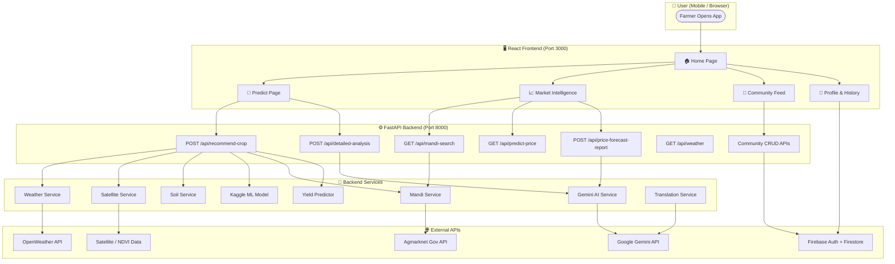
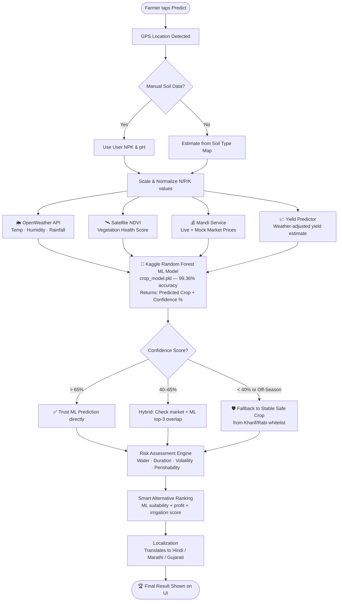
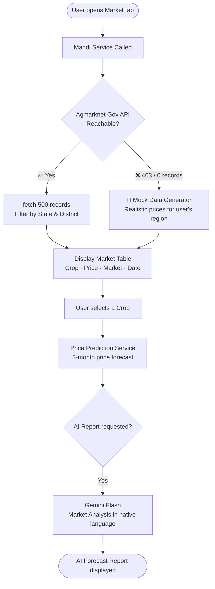
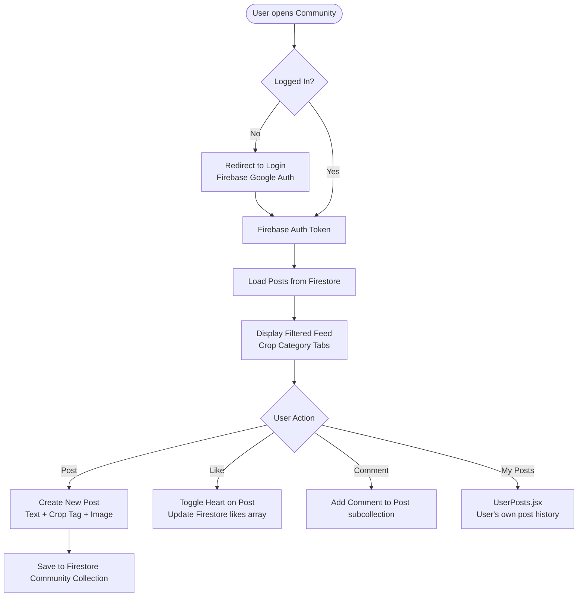
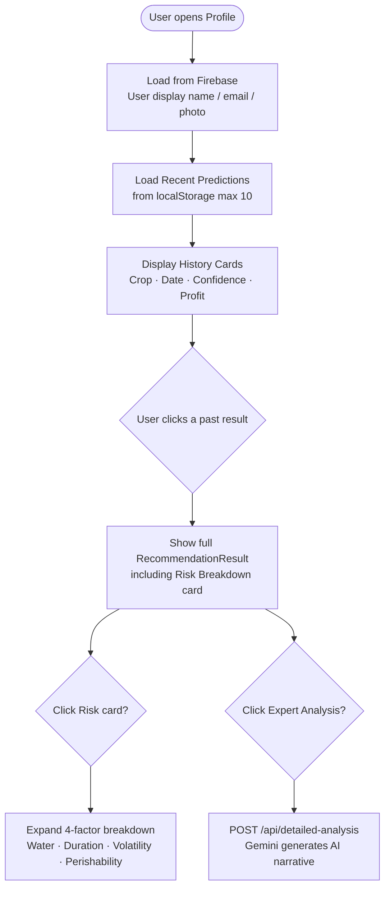

# 🌾 KrishiSense AI — Full Application Flow

This document maps the **entire** end-to-end flow of the KrishiSense AI platform, from user login to every feature.

---

## 🗺️ Top-Level Architecture

---

## 🌾 Crop Recommendation — Detailed Flow

---

## 📈 Market Intelligence — Detailed Flow

---

## 👥 Community Feed — Detailed Flow

---

## 👤 Profile & History — Detailed Flow

---

## 🔑 Key Technology Summary

| Layer | Technology |
|-------|-----------|
| **Frontend** | React 18 · i18next · Axios · CSS Glassmorphism |
| **Backend** | FastAPI · Python 3.11 |
| **Core Prediction** | Scikit-Learn Random Forest (Kaggle 99.36% accuracy) |
| **AI Analysis** | Google Gemini 2.5 Flash / gemini-flash-latest |
| **Yield Estimation** | Custom Regression Engine (Kaggle Crop-Yield-99 patterns) |
| **Market Data** | Agmarknet Gov API + Dynamic Mock Fallback |
| **Weather** | OpenWeather API + Satellite NDVI |
| **Authentication** | Firebase Auth (Google Sign-In) |
| **Database** | Firebase Firestore (Community) + localStorage (History) |
| **Caching** | requests-cache (2hr Mandi TTL) |
| **Languages** | English · हिंदी · मराठी · ગુજરાતી |
