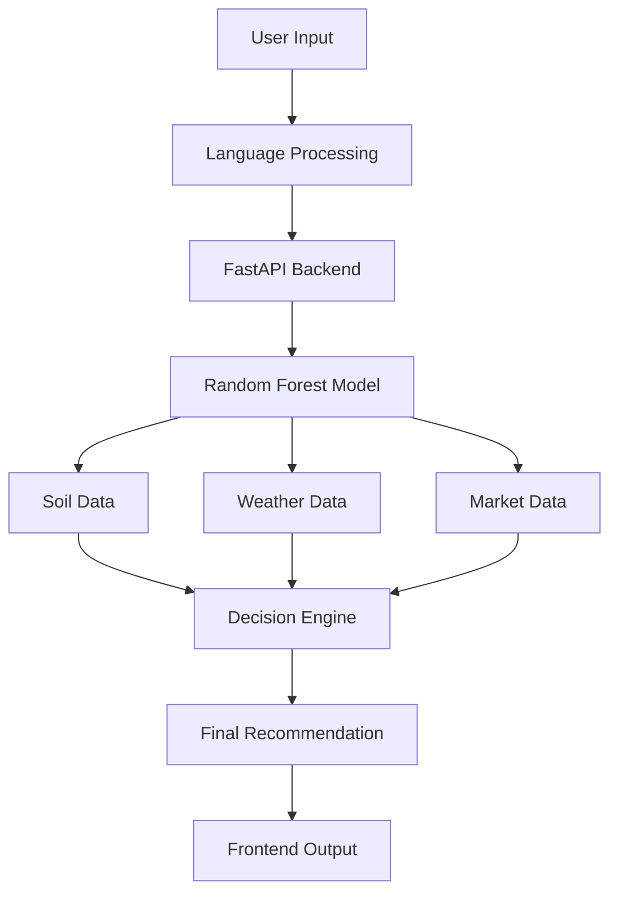

# 🌾 KrishiSense AI
### Smart Data-Driven Farming Platform
🚀 **Developed for AIXplore Hackathon | TGPCET, Nagpur**

   

---

## 🌟 Problem Statement
Farmers often face significant hurdles that impact their livelihood:
* ❌ **Incorrect crop selection** based on tradition rather than soil health.
* ❌ **Unpredictable market prices** leading to financial loss.
* ❌ **Lack of data-driven insights** regarding weather and irrigation.
* ❌ **Limited access** to modern, localized technology.

**👉 Result:** Low profitability and high risk for the farming community.

## 💡 Solution
**KrishiSense AI** is an AI-powered platform that bridges the gap between raw agricultural data and actionable intelligence. By combining soil analysis, real-time weather, and market trends, we provide a holistic recommendation engine.

---

## 🏗️ System Architecture



---

## 🎯 Key Features

### 🤖 Intelligent Crop Recommendation
* **Random Forest ML Model:** High-accuracy classification based on historical data.
* **Inputs:** NPK levels, pH, rainfall, and temperature.
* **Season-Aware:** Automatic filtering for **Kharif** and **Rabi** cycles.

### 💰 Market Intelligence
* **Real-time Mandi Prices:** Integration with Agmarknet for live price insights.
* **Harvest Prediction:** Estimates the best time to sell for maximum profit.

### 🔍 Transparent AI (Glass Box)
* We don't just give a name; we show the "Why." The UI explains the link between **Soil → Climate → Market** for every recommendation.

### 🌐 Accessibility & UI
* **Multi-language:** Support for Hindi, Marathi, and English.
* **Premium Design:** Glassmorphism UI with Dark Mode support.
* **Offline First:** Basic functionality remains accessible without a stable connection.

---

## 🧠 Decision Logic
The final output is calculated using a weighted multi-factor scoring system:

$$Final\ Score = S_{soil} + C_{climate} + W_{water} + V_{season} + P_{market}$$

> **Note:** If the model confidence falls below a specific threshold, a **Safety Fallback** is triggered to recommend traditional low-risk regional crops.

---

## 💻 Tech Stack

| Layer | Technology |
| :--- | :--- |
| **Frontend** | React.js, Context API, CSS (Glassmorphism) |
| **Backend** | FastAPI (Python) |
| **AI/ML** | Scikit-learn (Random Forest) |
| **Database** | Firebase |
| **APIs** | OpenWeather, Agmarknet |
| **Features** | Web Speech API, PWA (Offline Support) |

---

## 🚀 Getting Started

### 🔧 Backend
```bash
cd backend
pip install -r requirements.txt
python main.py
```

### 🎨 Frontend
```bash
cd frontend
npm install
npm start
```

### 📂 Project Structure
```text
KrishiSense-AI/
├── backend/      # FastAPI server & Logic
├── frontend/     # React App & UI components
├── ml_model/     # Training scripts & Pickle files
├── data/         # Dataset for training
└── README.md
```

---

## 📜 License
This project is licensed under the **MIT License** © 2026. 

**Team Members:**
* **Ayush Anupam** – AIML, 3rd Year
* **Sanket Bhende** – CSE, 2nd Year
* **Avijeet Jha** – CSE, 3rd Year
* **Vipul Pradesi**
