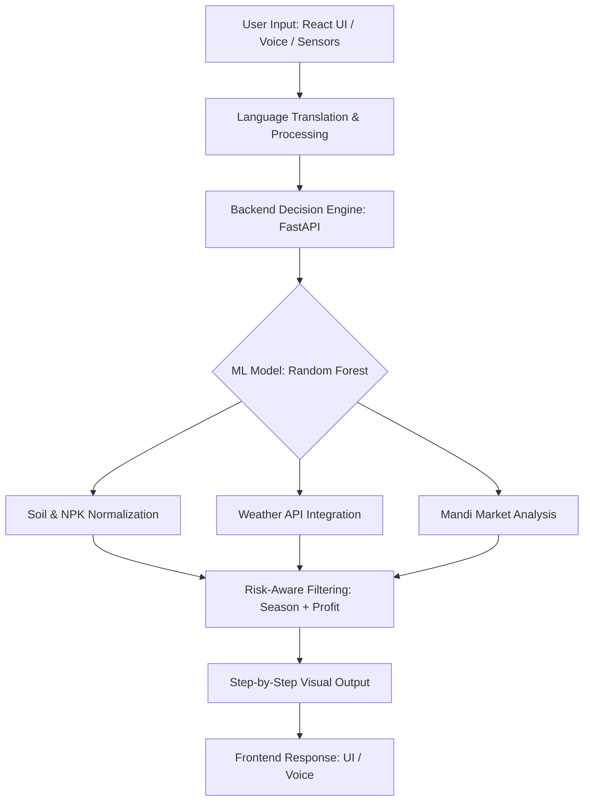

# 🌾 KrishiSense AI

### *Smart Data-Driven Farming Platform*

**Developed for AIXplore Hackathon | Tulsiramji Gaikwad-Patil College of Engineering, Nagpur**

[](https://opensource.org/licenses/MIT)
[](https://www.python.org/downloads/)
[](https://reactjs.org/)
[](https://fastapi.tiangolo.com/)

KrishiSense AI is an intelligent, AI-powered decision support system designed to help farmers optimize crop selection, maximize profitability, and build a collaborative agricultural ecosystem. We aim to bring AI to the roots of India, transforming raw data into actionable intelligence.

-----

## 🎯 Key Features

  * **🤖 Intelligent Crop Recommendation:** A risk-aware Random Forest ML model analyzing NPK levels, irrigation, and real-time weather with strict Kharif/Rabi seasonal filtering.
  * **💰 Advanced Market Intelligence:** Real-time mandi price insights with harvest cycle predictions and Pan-India price comparisons.
  * **📱 Farmer Community Dashboard:** A modern social feed for farmers to share insights, experience, and posts with an interactive UI.
  * **✨ Step-by-Step AI Visualization:** A transparent "Glass Box" approach: Soil → Climate → Market → Final Recommendation.
  * **🌓 Premium UI & Dark Mode:** Sleek Glassmorphism design with smooth animations and mobile-first responsiveness.
  * **🌐 Localization & Offline Support:** Multi-language support (Hindi, Marathi, English) and voice input for accessibility.

-----

## 🏗️ System Architecture



-----

## 💻 Tech Stack

| Component | Technology |
| :--- | :--- |
| **Frontend** | React.js, Context API, CSS (Glassmorphism) |
| **Backend** | FastAPI (Python) |
| **AI/ML** | scikit-learn (Random Forest) |
| **Database** | Firebase (Firestore, Auth, Storage) |
| **APIs** | OpenWeather API, Agmarknet |
| **Features** | Web Speech API, Offline Caching |

-----

## 🧠 Decision Logic & Risk Assessment

KrishiSense AI ensures reliable recommendations using a weighted scoring system:

$$Final Score = S_{soil} + C_{climate} + W_{water} + V_{season} + P_{market}$$

> **Note:** If the model confidence falls below a specific threshold, the system triggers a "Safety Fallback" to avoid risky recommendations for the farmer.

-----

## 🚀 Quick Start

### 🔧 Backend Setup

```bash
cd backend
pip install -r requirements.txt
python main.py
```

### 🎨 Frontend Setup

```bash
cd frontend
npm install
npm start
```

### 🧠 Train ML Model

```bash
cd ml_model
python train_model.py
```

-----

## 📂 Project Structure

```text
KrishiSense AI/
├── backend/           # FastAPI routes & business logic
├── frontend/          # React components & UI
├── ml_model/          # Training scripts & exported models
├── data/              # Datasets for NPK and Mandi prices
└── README.md
```

-----

## 🎤 Hackathon Pitch

> “KrishiSense AI transforms agricultural data into actionable intelligence. By combining soil analysis, weather insights, and market predictions, we empower farmers to make smarter, safer, and more profitable decisions. From soil to solution, from data to decisions — we build for those who feed the nation.”

-----

## 👨‍💻 The Team

  * **Ayush Anupam** – AIML, 3rd Year
  * **Sanket Bhende** – CSE, 2nd Year
  * **Avijeet Jha** – CSE, 3rd Year
  * **Vipul Pradesi** – 2nd Year

-----

## 📝 License

Distributed under the MIT License. See `LICENSE` for more information.

**Built with ❤️ at TGPCET, Nagpur**